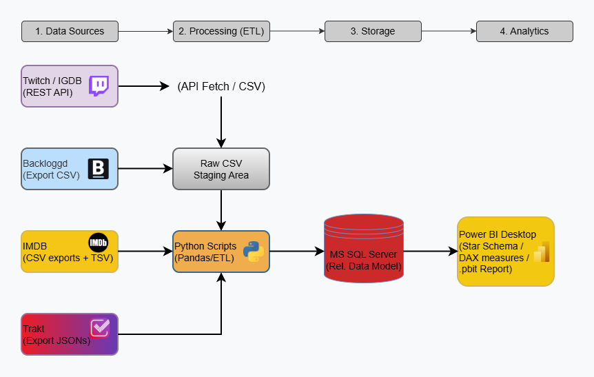
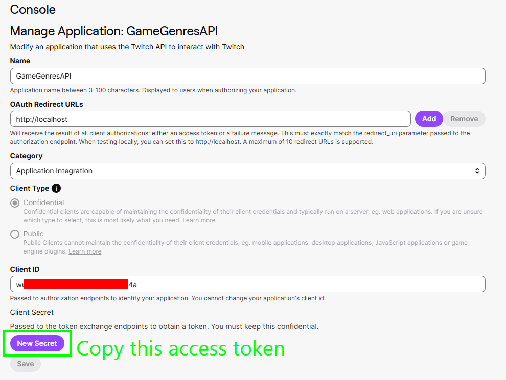
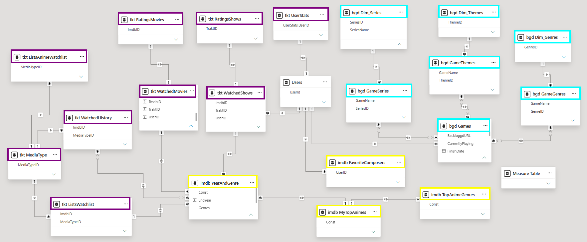

# MediaTrackerDB
A unified Business Intelligence and Data Warehousing project that consolidates personal entertainment logs across movies, TV shows, and video games into a normalized MS SQL database and an interactive Power BI dashboard.

The pipeline pulls data exports from tracking services (Trakt, IMDb, Backloggd) and enriches video game metadata via the **IGDB (Twitch) API**.

---
## 🎯 Purpose:
The goal of this project is to centralize and harmonize fragmented personal entertainment tracking into a single, unified business intelligence solution. By consolidating data across different media platforms (films, series, and games), the project eliminates data silos and provides holistic, data-driven insights into personal consumption habits, preferences, and long-term rating patterns.

---

## 💡 Why is it useful?

* **Unified Entertainment Hub:** Entertainment trackers are typically siloed by medium (films/TV on IMDb and Trakt, games on dedicated platforms). This project brings them together under a single dimensional model for seamless cross-media analytics.

* **Deep Cross-Dimensional Analysis:**
  * Evaluates personal bias and rating trends across release years (classic nostalgia vs. modern releases).
  * Normalizes delimited multi-genre tags into granular dimensions for accurate categorical breakdown.
  * Tracks watch history, velocity, and viewing consistency over time.

* **Robust Data Engineering & Modeling:**
  * Star/snowflake schema design with relational normalization in MS SQL Server.
  * Power Query ETL pipelines (string manipulation, row expansion, data sanitation, and type safety).
  * Advanced DAX modeling covering weighted rating averages, dynamic age calculations, and bidirectional cross-filtering.

* **Privacy-First & Fully Reusable (Template-Ready):** Distributed with a sanitized, schema-only database backup/DDL and a `.pbit` (Power BI Template) file. Anyone can spin up the environment and plug in their own tracking history without exposing personal logs or credentials.

---
## 🔄 Architecture & Data Pipeline

## 🚀 Setup & Execution Guide

### 1. Data Exports

Collect your personal tracking data from the following platforms:

* **Backloggd (Video Games):**
  Export your game library using the [Backloggd Plus Firefox Extension](https://addons.mozilla.org/en-US/firefox/addon/backloggd-plus/) (refer to [this community thread](https://www.reddit.com/r/backloggd/comments/1ua0po6/backloggd_extension_export_your_library/) for details).
* **IMDb (Watchlist & Metadata):**
  * Export your personal lists under **Your Lists** &rarr; **••• (Menu)** &rarr; **Export**.
  * Download public title metadata (`title.basics.tsv.gz`) from [datasets.imdbws.com](https://datasets.imdbws.com/). To optimize performance and storage, filter down this file to keep only rows matching your `WatchedHistory` title IDs.
* **Trakt (Movies & TV Shows):**
  Export your raw tracking data via **Settings** &rarr; **[Data](https://app.trakt.tv/settings/data)** &rarr; **Export Now**.

---

### 2. IGDB / Twitch API Credentials

Game enrichment scripts query the [IGDB API](https://api-docs.igdb.com/),
which authenticates via Twitch Developer services (free for both personal and commercial use):

1. Register on the [Twitch Developer Console](https://dev.twitch.tv/console) and create an application.
2. Generate your **Client ID** and **App Access Token** (or Client Secret).
3. Create a `.env` file in the root folder alongside the ingestion scripts:

TWITCH_CLIENT_ID=your_client_id_here

TWITCH_APP_ACCESS_TOKEN=your_generated_token_here

### 3. Database Initialization
1. Restore the provided template database (MediaTrackerDB_template.bak) onto your local MS SQL Server instance, or execute the schema creation scripts.
2. Verify table structures, primary keys, and foreign key relationships across the staging and reporting schemas.

### 4. Data Ingestion (ETL)
1. Open the loader scripts / notebooks.
2. Confirm your connection string matches your local instance name and target database
3. Update the source file paths to point to your exported CSV/TSV files, then execute the loader to populate the tables.

### 5. Power BI Reporting
1. Launch MediaTrackerDB_Template.pbit in Power BI Desktop.
2. When prompted for parameters, enter your local SQL Server instance name and database name.
3. If credentials fail to connect immediately:
    * Go to Home → Transform Data → Data Source Settings.
    * Select your connection and choose Change Source... to re-point to your local instance.
4. Click Refresh to load your personal data into the model.

---
## 📐 Data Model
The data model uses a normalized star/snowflake schema optimized for high-performance cross-filtering:

## See the Dashboard here: https://revoltec007.github.io/mediatrackerdb.html